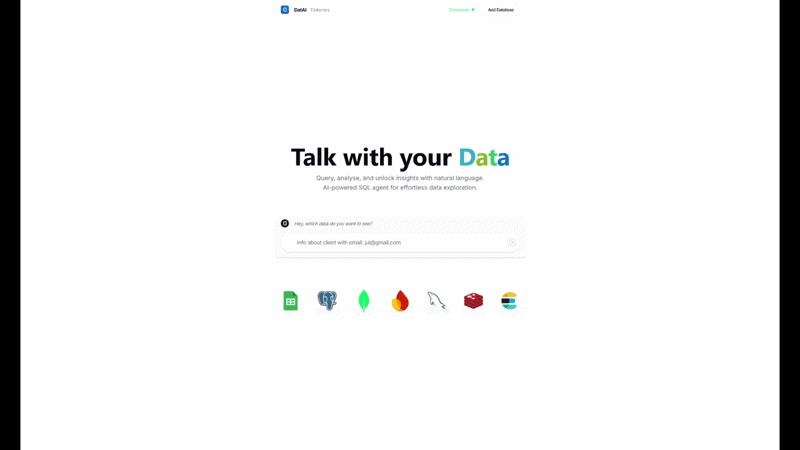

<h1 align="center">DATAI</h1>

<p align="center">
  AI-powered natural language interface for your database. No SQL needed.
</p>

---


## About

**DATAI** is an AI agent that lets anyone query a PostgreSQL database using plain English. Ask questions like *"Who are my top customers?"* or *"Show me monthly revenue as a chart"* and DATAI generates and executes the SQL behind the scenes — returning results instantly.

Built with Next.js, TailwindCSS, shadcn-ui, and the Vercel AI SDK. Supports Anthropic Claude, OpenAI, and Google Gemini as the AI provider.

---

## Requisites ⚙️

- **Node.js 18+** and npm — [Download](https://nodejs.org/en/download)
- **pnpm** — install with `npm install -g pnpm`
- **PostgreSQL** running locally or on a cloud provider (Supabase, Neon, etc.)
- An API key for one of the supported AI providers (see below)

---

## Quick Start 🚀

**1. Clone the repository:**
```bash
git clone https://github.com/HazielCancino/datai-main/
cd datai-main
```

**2. Install dependencies:**
```bash
pnpm install
```

**3. Set up your environment:**

Rename `.example.env` to `.env` and fill in your values:

```env
# Pick ONE of these depending on your provider:
ANTHROPIC_API_KEY=your_key_here
OPENAI_API_KEY=your_key_here
GOOGLE_GENERATIVE_AI_API_KEY=your_key_here

# Database
DATABASE_HOST=localhost
DATABASE_PORT=5432
DATABASE_USER=postgres
DATABASE_PASSWORD=your_password
DATABASE_NAME=datai
```

**4. Set up the database:**

Create a `datai` database in PostgreSQL, then run the seed script found in `/scripts/setup_datai.sql` to create all tables and populate them with sample data.

**5. Start the dev server:**
```bash
pnpm dev
```

**6. Open [http://localhost:3000](http://localhost:3000) and start chatting with your data!**

---

## AI Providers

Update `src/app/api/chat/route.ts` to switch providers:

| Provider | Package | Model |
|---|---|---|
| Anthropic (Claude) | `@ai-sdk/anthropic` | `claude-3-5-sonnet-latest` |
| OpenAI | `@ai-sdk/openai` | `gpt-4o-mini` |
| Google Gemini | `@ai-sdk/google` | `gemini-2.0-flash` |

---

## Database Schema

The sample database includes these tables:

- **users** — user profiles, subscription plans, country, registration date
- **usage_summary** — token consumption and estimated message counts per user
- **pricing_plans** — plan names, monthly prices, token limits
- **token_costs** — cost per token per plan (for profitability analysis)
- **customer_support_tickets** — support requests and their status
- **feature_usage** — which features users interact with and how often

---

## Tech Stack

- [Next.js](https://nextjs.org/) — React framework
- [TailwindCSS](https://tailwindcss.com/) — Utility-first CSS
- [shadcn-ui](https://ui.shadcn.com/) — UI components
- [shadcn-chat](https://github.com/jakobhoeg/shadcn-chat) — Chat components
- [Framer Motion](https://www.framer.com/motion/) — Animations
- [Vercel AI SDK](https://sdk.vercel.ai/) — AI/ML streaming
- [postgres.js](https://github.com/porsager/postgres) — PostgreSQL client
- [Recharts](https://recharts.org/) — Chart visualizations
- [Lucide Icons](https://lucide.dev/) — Icon library